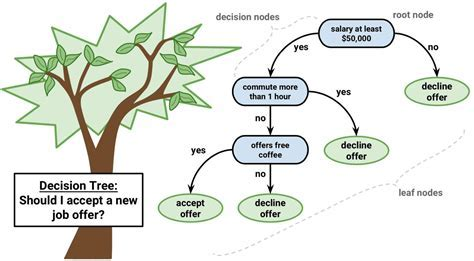
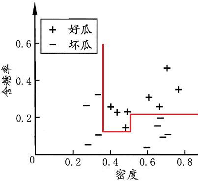
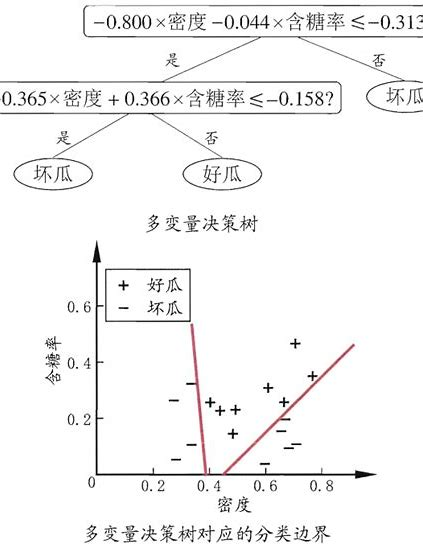
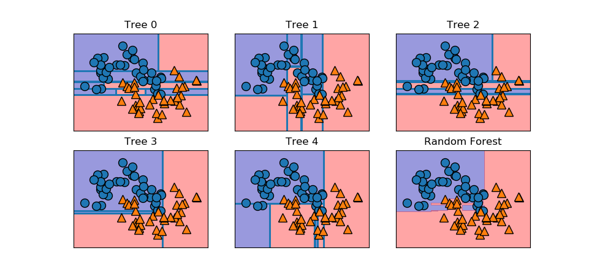

# 随机森林(random forest)
随机森林是深度学习诞生之前，最常用于作为分类、回归的模型。这里将其拆分成决策树、Bagging集成算法、随机森林三部分介绍。
## 一、决策树(decision tree)
### 1.1 介绍
以分类问题为例，在基于概率的机器学习算法中，分类可以分为推断(inference)和决策(decision)两步。推断是求关于目标变量的后验分布P(Y|X)，而决策则是基于该后验分布给Y一个合理的估计。
此外，还有一种不引入概率的模型，即直接用一个函数将X映射到Y，该函数称为判别函数(discriminant function)，决策树就是其中的一种。

决策树认为人类在处理决策任务时依赖一个判定测试序列，比如我们要判断一个西瓜甜不甜(分类问题)，我们会先判断它的色泽是否是绿色的，然后判断它的根茎是什么形态，再判断它敲击的声音，通过该判断测试序列，
得到这个西瓜甜不甜的结论。将一个问题的判断测试序列表示成树的形式，即决策树。



在决策树中，叶子节点对应决策结果，而其余节点则对应一个属性(特征)测试，从根节点到任一叶子节点的路径对应了一个判定测试序列。

### 1.2 构造决策树
给定一个训练集D = {(X<sub>i</sub>, Y<sub>i</sub>)} i=1, 2, 3,...,N，和Xi的属性集A = {ai} i =1, 2, ...,d，下面讨论如何构造一个合理的决策树。

#### 1.2.1 ID3决策树算法
ID3算法的流程为：
```
1. 从根节点开始，计算根节点样本的信息熵；
2. 根据特征，计算出各个特征的信息增益；
3. 在每个节点上利用信息增益进行特征选择，选择信息增益最大的特征。
4. 如果全部是一类，则输出叶子节点，如果存在多类的情况，则需要重新寻找最优特征，直到剩余特征的信息增益小于阈值，或已经没有可以选择的特征时停止；
5. 对决策树进行剪枝优化。
```


ID3构建决策树的过程基于信息论，信息增益(Info Gain)就是信息论中的互信息:

Gain(D, ai) = I(D;ai) = H(D)-H(D|ai)

a* = argmax<sub>ai</sub> I(D;ai)， ai∈A

其中D=(X, Y)代表决策树某节点处样本变量，D与Y服从相同分布，H(D)表示样本的熵；而ai代表样本的属性变量，H(D|ai)代表D关于ai的条件熵。ID3对于决策树的构建有这样的策略
—— 决策树应尽快降低样本的不确定性(熵)，或者说决策树的层数应尽可能地少，这从某种程度上说反映了奥卡姆剃刀准则。然而这个问题是一个NP难的问题，ID3是近似求解该问题的一种贪婪算法，
在每一步取信息增益最大的属性作为判断属性。由于对总体分布未知，熵的计算是通过对训练集的样本统计得到的经验熵。随着决策树趋于叶子节点，
相应样本数也会减少，用来估计熵的统计量的方差会变大，发生过拟合。因此需要在决策树构造之后引入剪枝(pruning)操作，提高模型的泛化性能。

#### 1.3 C4.5决策树算法

信息增益准对取值数目较多的属性有所偏好，为减少这种偏好的影响，C4.5决策树算法提出用增益率(gain ratio)代替信息增益，即将信息增益除以一个衡量属性ai取值数目的测度，
这种思想在图论的切图添加平衡条件也有体现。

C4.5决策树算法没有直接用属性取值的个数作为测度，而是使用了属性ai的熵作为测度：

H(ai) = ΣP(ai)logP(ai)

Gain_ratio(D, ai) = Gain(D, ai) / H(ai)

a* = argmax<sub>ai</sub> I(D;ai) / H(ai)， ai∈A

需要注意的是，使用增益率准则可能会对取值较少的属性有偏好，因此C4.5使用了一个启发式算法，即先从候选属性中找出信息增益高于平均水平的属性，再从中选择增益率最高的。

#### 1.4 CART决策树
CART决策树使用基尼指数(Gini index)来选择划分属性。先介绍基尼值(Gini Value)：

Gini(D) = 1 - Σ<sub>Y</sub>P(Y)<sup>2</sup>

基尼值的意义是从变量D的分布中随机抽出两个样本，两个样本类别不一样的概率。因此熵反映了一个变量的随机性(杂乱度)，而基尼值则反映了变量的“纯净度“，值越大说明越”纯净“。基尼指数即：

Gini_index(D, ai) = Σ<sub>ai</sub>p(D|ai)Gini(D, ai)

a* =argmin<sub>ai</sub> Gini_index(D, ai) , ai∈A

#### 1.5 剪枝处理
剪枝(pruning)分为预剪枝(prepruning)和后剪枝(postpruning)：
1. 预剪枝指在决策树生成过程中，对每个节点在划分前进行估计，如果当前节点的划分不能带来决策树泛化性能的提升则停止划分，
将当前节点标记成叶子节点。
2. 后剪枝指先用训练集生成一个完整的决策树，然后自底向上地对非叶子节点进行考察，如果当前节点对应的子树替换为叶子节点可以带来泛化性能地提升则将该子树替换为叶子节点。

需要注意地是，在用预剪枝的时候，有些分支当前划分不能提高泛化性能，但在此基础上后续划分可以导致性能上升，预剪枝的”贪心“本质禁止这些分支展开，给预剪枝带来了***欠拟合***的风险。
而后剪枝的欠拟合风险则很小，泛化性能往往优于预剪枝的决策树，但相应的，后剪枝的训练开销要比预剪枝和未剪枝决策树大得多。

#### 1.6 连续属性和缺失属性处理
1. 对于连续取值的属性变量ai，不能直接用连续属性的可取值对节点进行划分。可以把D中关于ai的取值由小到大排序，得到{a<sup>1</sup>,a<sup>2</sup>, ...a<sup>n</sup>}，
然后用相邻点的平均值作为候选划分点，对属性ai进行一个二划分。***注意：相邻节点不能对同一离散属性进行划分，而连续属性变量可以。***
2. 对于有缺失部分属性的数据，如果直接丢弃的话成本太高，可以在每一节点处使用属性ai将D中不缺失ai的数据找出来进行处理。

#### 1.7 总结
决策树的决策边界(decision boundary)是轴平行的，这样的决策边界具有较好的可解释性，但也限制了决策树模型的解决复杂分类边界的能力。



也有将线性分类器和神经网络嵌入决策树的模型，称为多变量决策树和感知机树。



决策树模型和其它模型相比最大的优势在于可解释性和对低维，离散属性(特征)的处理。比如通过体检报告推断身体状况，可以将一些指标编码成决策树地形式，也可以通过模型发现这些指标规则。

## 二、集成学习(ensemble learning)
集成学习通过构建并结合多个学习器来完成学习任务，也被称为多分类器系统(multi-classifier system)、基于委员会地学习(committee-based learning)。
集成学习把多个学习器进行结合，来获得比单一学习器显著优越的泛化性能，而这对个体学习器的要求是“好而不同”。

根据个体学习器的生成方式，集成学习方法大致可分为两大类：

1. 个体学习器之间存在强依赖关系，必须串行生成的方法，代表为Boosting。
2. 个体学习器之间不存在强依赖关系，可同时生成的并行化方法，代表为Bagging和随机森林。

### 2.1 Boosting
Boosting集成算法先从训练集训练出一个基学习器，再根据基学习器的表现对训练集的分布进行调整，对做错的样本在后面给予更多的关注，用调整后的训练集分布训练下一个基学习器。如此重复，直到学习器数目达到预设的值T，
用T个学习器进行加权结合。从方差-偏差分解的角度，Boosting更关注降低降低学习器偏差。代表算法为AdaBoost。


### 2.2 Bagging与随机森林
#### 2.2.1 Bagging
Bagging(Bootstrap aggregating)的基本思想是对训练集进行采样，划分成互相有交叠的采样子集后进行训练。如果没有交叠会导致个体学习器只用一小部分样本训练，
不能确保产生“好”的个体学习器。

具体来说就是对训练集进行有放回采样(也称为自助采样 bootstrap sampling)m个点，有大约1-1/e≈63.2%的样本出现在采样集合中。用bootstrap sampling采样出T个含m个样本的采样集，然后用每个采样集训练
个体学习器(bagging中又称为基学习器)，然后进行结合，对分类任务用投票，对回归任务用简单平均。

从方差-偏差分解的角度看，Bagging关注降低方差，即对一些过拟合的基学习器(e.g., 未剪枝的决策树)，通过Bagging集成之后可以提升泛化性能。

#### 2.2.2 随机森林
随机森林在以决策树为基学习器构建Bagging集成的基础上，进一步在训练过程中引入了随机属性的选择，具体来说传统决策树要在当前属性集合选择一个最优属性，
而随机森林则先从该集合中随机选择k个属性，再从中选择一个最好的，一般取k=log<sub>2</sub>d。

随机森林的随机性不仅来自样本扰动，还来自属性扰动，使得基学习器之间差异度进一步增大，从而提升最终泛化效果。

### 2.3 多样性增加方法
集成学习需要生成多样性大的个体学习器，提高个体学习器差异性有以下方式：
1. 训练集扰动：使用不放回采样(bootstrap sampling)技术产生互相交叠的训练集，然后用这些不同的训练集进行训练个体学习器。这种方法对诸如神经网络、决策树这类对训练样本很敏感(称为不稳定基学习器
)很有效。然而对于那些稳定的基学习器，比如SVM，KNN则需要引入其它扰动机制。
2. 属性扰动：训练数据由一组属性描述，从这些属性构成的集合中，随机地选择若干属性子集，再基于每个属性子集构造一个基学习器。这种方法对本身包含大量冗余的数据十分有效，还能减少训练时常，e.g.，随机森林。
3. 输出扰动：随机改变一些训练样本的类别来构建基学习器。
4. 算法参数扰动：比如通过对神经网络随机初始化权重产生差别较大的个体学习器。

### 2.4 基学习器结合策略
对于回归任务，一般用平均法或者加权平均法；对于分类任务，一般用投票法或者加权投票法。除此之外还有一种更为强大的结合策略，即学习法，通过另一个学习器来学习结合的参数，Stacking就是其中的代表。我们把个体学习器称为初级学习器，
而把用于结合的学习器称为次级学习器或者元学习器(meta-learner)。Stacking先从初始训练集训练初始学习器，然后把初始学习器的输出当作训练集训练次级学习器。

**注意**：为了避免次级学习器过拟合，一般用训练初级学习器未使用的样本来产生次级学习器的训练样本。

## 三、结果

使用五个决策树作为基学习器进行随机森林分类试验结果如下：



可以看到，由于随机森林中对训练集进行扰动 + 对属性进行扰动，不同学习器之间(决策边界)差异性较大。另外可以看到，单个决策树都不能很好的将样本分开，发生了较为严重的过拟合，
但当五个过拟合的基学习器集成在一起后，分类结果还算不错，说明Bagging集成学习方法有降低损失函数方差的效果。


## 四、参考
[1] 周志华. 机器学习 : = Machine learning[M]. 清华大学出版社, 2016.
